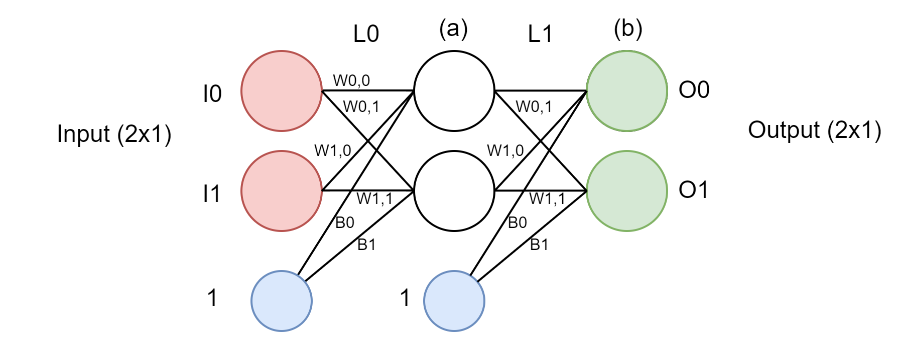
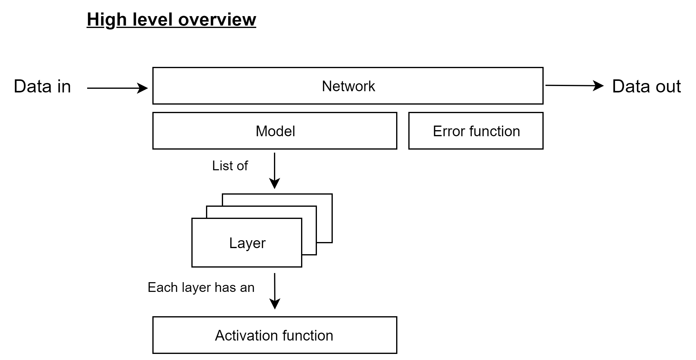

# Simple net
A very simple implementation of a neural network.
#### Motivation

I will be doing my final thesis in deep neural networks applied to computer vision, and I know (almost) nothing about neural networks. I should learn how do they work if I want to do a competent project. By implementing one from scratch I will (supposedly) understand their inner workings. 

#### Structure

#### Implementation bits
I wrote some equations here -> <link>

#### Missing features
- Add some examples
- YAML configuration
- Regularization
- Dropout
- Batch normalization
- Other layers (not fully connected)
- Implement other optimizers (SGD, Adam)
- Other initializations
- Recurrent neural networks
- Convolutional neural networks

#### Conclusions
This late-night/early morning project has exceeded my expectatives, it is very interesting to see the model learning. Although it is very unlikely that I will complete any of the missing features in the near future, I will leave it open just in case.

#### Resources
[3Blue1Brown neural networks playlist](https://www.youtube.com/playlist?list=PLZHQObOWTQDNU6R1_67000Dx_ZCJB-3pi): 3Blue1Brown is a great divulgator, these videos are great for an introduction to the subject. The fourth video is a simple but good way to understand everything that it's going in mathematical terms.  
[Brandon Rohrer nn-framework repository](https://github.com/brohrer/nn_framework):
I roughly followed the repo for the code structure.  
[Michal Nielsen neural networks and deep learning book chapter 2](http://neuralnetworksanddeeplearning.com/chap2.html): Formal proof of backpropagation. To be sincere I couldn't follow most of it. Will revise in the future.